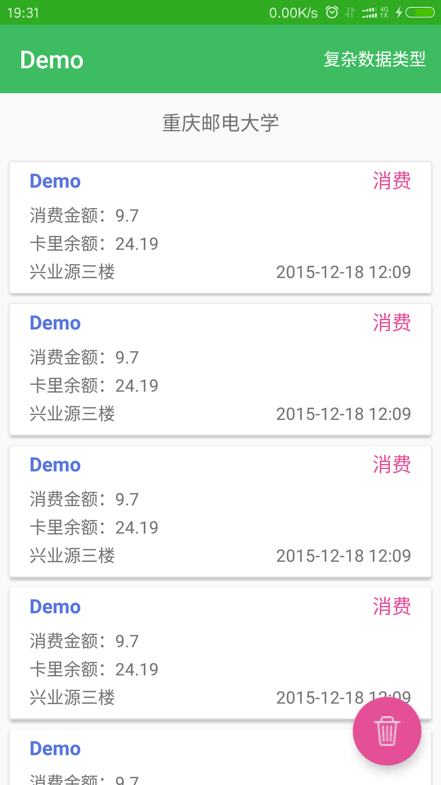

# RefreshRecyclerView
> - RecyclerAdapter : 支持下拉刷新，上拉加载，添加Header，Footer
> - MultiTypeAdapter : 针对复杂数据类型的数据列表
        
## 使用方法

 - gradle依赖

```
   compile 'cn.lemon:RefreshRecyclerView:1.1.9'
```

 - xml布局文件

```xml
    <cn.lemon.view.RefreshRecyclerView
        android:id="@+id/recycler_view"
        android:layout_width="match_parent"
        android:layout_height="wrap_content"
        app:refresh_able="true"
        app:load_more_able="false"/>
```
         
 - java代码

```
   mRecyclerView = (RefreshRecyclerView) findViewById(R.id.recycler_view);
   mRecyclerView.setSwipeRefreshColors(0xFF437845,0xFFE44F98,0xFF2FAC21);
   mRecyclerView.setLayoutManager(new LinearLayoutManager(this));
   mRecyclerView.setAdapter(mAdapter);
   mRecyclerView.setRefreshAction(new Action() {
        @Override
        public void onAction() {
            getData(true);
        }
   });

   mRecyclerView.setLoadMoreAction(new Action() {
        @Override
        public void onAction() {
            getData(false);
            page++;
        }
   });
   mAdapter.setHeader(textView); //添加Header
   mAdapter.setFooter(footer); //添加Footer
```
                
###RecyclerAdapter

>针对相同数据类型列表，可添加 Header，Footer

自定义 Adapter 应该继承 RecyclerAdapter<T>，如：

```java
class CardRecordAdapter extends RecyclerAdapter<Consumption> {

    public CardRecordAdapter(Context context) {
        super(context);
    }

    @Override
    public BaseViewHolder<Consumption> onCreateBaseViewHolder(ViewGroup parent, int viewType) {
        return new CardRecordHolder(parent);
    }
}
```

###MultiTypeAdapter

>复杂数据类型列表的 Adapter，没有 Header,Footer 的概念，每个 Item 对应一个 ViewHolder

```
 private MultiTypeAdapter mAdapter;
 mAdapter.add(ImageViewHolder.class, getImageVirtualData());
 mAdapter.addAll(TextViewHolder.class, getTextVirtualData());
 mAdapter.addAll(TextImageViewHolder.class, getTextImageVirualData());
 mAdapter.addAll(CardRecordHolder.class, getRecordVirtualData());
```

###ViewHolder

>自定义 ViewHolder 需继承 BaseViewHolder<T>，如：

 ```java
 class CardRecordHolder extends BaseViewHolder<Consumption> {

     //当使用MultiTypeAdapter时，务必加上此构造方法
     public CardRecordHolder(ViewGroup parent) {
         super(parent, R.layout.holder_consume);
     }

     @Override
     public void setData(Consumption object) {
         super.setData(object);
         name.setText("Demo");
         //UI绑定数据
     }

     @Override
     public void onInitializeView() {
         super.onInitializeView();
         name = findViewById(R.id.name);
         //初始化View
     }

     @Override
     public void onItemViewClick(Consumption object) {
         super.onItemViewClick(object);
         //点击事件
     }
 }
 ```
 **注意**：MultiTypeAdapter 使用的 ViewHolder, 构造函数为保证反射时能获取到，应该写成静态或者 public 的单独类

[详细用法请看Demo](https://github.com/llxdaxia/RecyclerView/tree/master/demo)

### 注意事项

 - 依赖了其他库

```
    compile 'com.android.support:recyclerview-v7:25.2.0'
```



