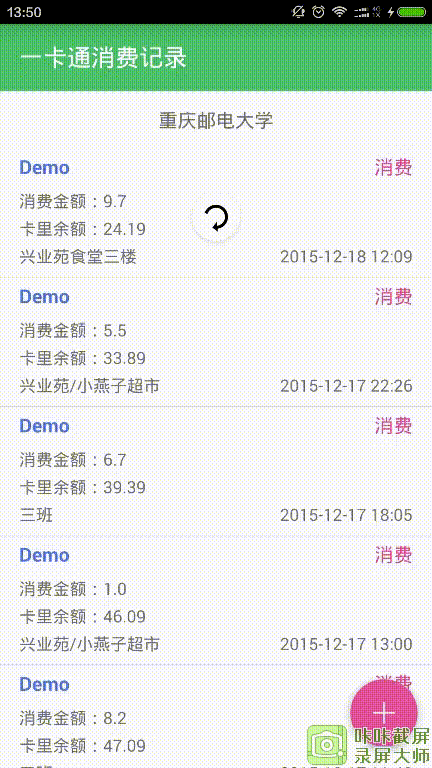

# RefreshRecyclerView --- 可下拉刷新，上拉加载，添加Header，Footer的RecyclerView
        
## 使用方法

gradle依赖

```java
   compile 'cn.lemon:RefreshRecyclerView:0.1.0'
```

xml布局文件

```xml
  <cn.lemon.view.RefreshRecyclerView
     xmlns:android="http://schemas.android.com/apk/res/android"
     android:id="@+id/refresh_recycler_view"
     android:layout_width="match_parent"
     android:layout_height="wrap_content"
     android:layout_marginTop="?attr/actionBarSize" />
```
         
java代码

```java
  refreshRecyclerView = (RefreshRecyclerView) findViewById(R.id.refresh_recycler_view);
  refreshRecyclerView.setLayoutManager(new LinearLayoutManager(this));
  refreshRecyclerView.setAdapter(adapter);
```
                
RefreshRecyclerView需要设置一个Adapter。

Adapter应该继承 RecyclerAdapter<T>，如：

```java
   class MyAdapter extends RecyclerAdapter<Consumption>
```

自定义的Adapter重写两个方法就好了。

```java
   public MyAdapter(Context context) {
        super(context);
   }
        
   @Override
   public BaseViewHolder<Consumption> onCreateBaseViewHolder(ViewGroup parent, int viewType) {
        return new MyViewHolder(parent.getContext(), R.layout.item_consume);
   }
```
        
RecyclerView使用了ViewHolder，自定义ViewHolder需继承BaseViewHolder<T>,如：

```java
   class MyViewHolder extends BaseViewHolder<Consumption>
```
     
自定义的ViewHolder重写两个方法就好了。

```java
    class MyViewHolder extends BaseViewHolder<Consumption> {
        
        private TextView name;
        private TextView type;
        private TextView consumeNum;
        private TextView remainNum;
        private TextView consumeAddress;
        private TextView time;

        public MyViewHolder(ViewGroup parent) {
            super(parent, R.layout.item_consume);
            itemView.setLayoutParams(new FrameLayout.LayoutParams(ViewGroup.LayoutParams.MATCH_PARENT, ViewGroup.LayoutParams.WRAP_CONTENT));
            name = (TextView) itemView.findViewById(R.id.name);
            type = (TextView) itemView.findViewById(R.id.type);
            consumeNum = (TextView) itemView.findViewById(R.id.consume_num);
            remainNum = (TextView) itemView.findViewById(R.id.remain_num);
            consumeAddress = (TextView) itemView.findViewById(R.id.consume_address);
            time = (TextView) itemView.findViewById(R.id.time);

        }

        @Override
        public void setData(Consumption object) {
            super.setData(object);
            name.setText("Demo");
            type.setText(object.getLx());
            consumeNum.setText("消费金额：" + object.getJe());
            remainNum.setText("卡里余额：" + object.getYe());
            consumeAddress.setText(object.getSh());
            time.setText(object.getSj());
        }
    }
```

开发中可能还会给每个item设置点击事件，在ViewHolder的setData(Object object)方法中设置

```java
  itemView.setOnClickListener(new View.OnClickListener() {
           @Override
           public void onClick(View v) {
                            
           }
      });
```

### RefreshRecyclerView添加Header或Footer
     
```java
   adapter = new MyAdapter(this);
   //添加Header
   TextView textView = new TextView(this);
   textView.setLayoutParams(new LinearLayoutCompat.LayoutParams(ViewGroup.LayoutParams.MATCH_PARENT, Utils.dip2px(48)));
   textView.setTextSize(16);
   textView.setGravity(Gravity.CENTER);
   textView.setText("重庆邮电大学");
   adapter.setHeader(textView);
```
        
### RefreshRecyclerView设置`加载更多的View`
           
```java
   LinearLayout linearLayout = new LinearLayout(this);
   linearLayout.setOrientation(LinearLayout.HORIZONTAL);
   linearLayout.setLayoutParams(new FrameLayout.LayoutParams(ViewGroup.LayoutParams.MATCH_PARENT, Utils.dip2px(48)));
   linearLayout.setGravity(Gravity.CENTER);
   final ProgressBar progressBar = new ProgressBar(this);
   progressBar.setLayoutParams(new FrameLayout.LayoutParams(Utils.dip2px(24), Utils.dip2px(24)));
   TextView moreView = new TextView(this);
   moreView.setGravity(Gravity.CENTER);
   moreView.setText("正在加载......");
   linearLayout.addView(progressBar);
   linearLayout.addView(moreView);
   refreshRecyclerView.setLoadMoreView(linearLayout);
```

### RefreshRecyclerView下拉刷新
    
```java
    refreshRecyclerView.refresh(new Action() {
        @Override
        public void onAction() {
             getData(1, false);
        }
     });
```

记得在刷新完数据够关闭刷新动画       

```java
refreshRecyclerView.dismissRefresh();
```
 
`可能有的时候不需要下拉刷新的功能，调用closeRefresh()方法关闭就好了。`

### RefreshRecyclerView上拉加载更多

```java
refreshRecyclerView.loadMore(new Action() {
      @Override
      public void onAction() {
           getData(page++, true);
      }
    });
```
    
在加载完数据的时候还可以调用

```java
refreshRecyclerView.stopMore();  停止加载
```

并且还可以设置停止加载的View

```java
   TextView stop = new TextView(this);
   stop.setLayoutParams(new FrameLayout.LayoutParams(ViewGroup.LayoutParams.MATCH_PARENT, Utils.dip2px(48)));
   stop.setGravity(Gravity.CENTER);
   stop.setText("没有更多了O(∩_∩)O~");
   refreshRecyclerView.setNoMoreView(stop);
```

### 注意事项

依赖了其他库

```java
   compile 'com.android.support:appcompat-v7:23.1.1'
   compile 'com.android.support:recyclerview-v7:23.1.1'
```

### [Demo](https://github.com/llxdaxia/RefreshRecyclerView/tree/dev/app)
